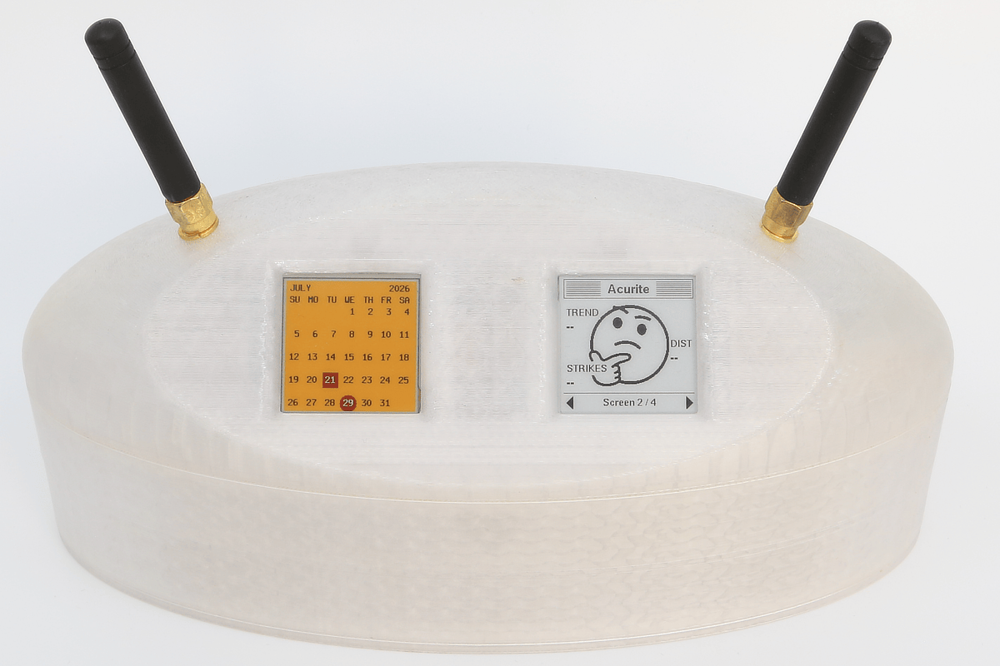

# cc433
Like rtl_433, only for Pico and CC1101!

* Embedded RF receiver framework for CC1101 radios.

* Inspired by rtl_433 and designed for RP2040-class microcontrollers.

---

# Overview

This project explores a simple question:

> Can the rtl_433 architecture be preserved while replacing the SDR front-end with a CC1101 radio and RP2040 microcontroller?

The answer is:

**Yes.**

The system successfully decodes multiple independent real-world devices using a single RF receiver, a single capture pipeline, and device-specific rtl_433-style decoders.

No Linux.

No RTL-SDR.

No network connection.

Just a Pico, a CC1101, AI, and a lot of stubbornness.

---

## Shared SPI Bus

cc433 includes `managed_spi.py`, a small helper that ensures a hardware SPI configuration is instantiated only once.

This is useful when multiple peripherals (for example, a CC1101 radio and an e-paper display) share the same RP2040 SPI bus. It also detects conflicting attempts to configure the same bus differently, helping catch configuration errors early.

---

## Hello World

```python
from managed_spi import SpiBusManager
from cc433.drivers.cc1101_radio import CC1101Radio
from cc433.devices.acurite import make_acurite_6045m_device
from cc433.acquisition_engine import (
    AcquisitionEngine,
    run_pio_capture_loop,
)

spi_bus = SpiBusManager.get_spi(
	"acurite_6045m_device",
	1,
	sck=10,
	mosi=11,
	miso=12,
	baudrate=2_000_000,
)

radio = CC1101Radio(
    spi_bus=spi_bus,
    cs_pin=13,
    gdo0_pin=14,
    gdo2_pin=9,
    debug=LOG_NONE,
)

engine = AcquisitionEngine(radio)

devices = (
    make_acurite_6045m_device(),
)

def on_decoded(decoded):
    print()
    print("Decoded packet")
    print("--------------")
    print("Model       :", decoded.get("model", ""))
    print("Raw message :", decoded.get("raw_msg"))
    print("Sensor ID   :", decoded.get("id"))
    print("Channel     :", decoded.get("channel"))
    print("Battery OK  :", decoded.get("battery_ok"))
    print("Active      :", decoded.get("active"))
    print("RFI         :", decoded.get("rfi"))
    print("Temperature :", decoded.get("temperature_F"), "F")
    print("Humidity    :", decoded.get("humidity"), "%")
    print("Strike count:", decoded.get("strike_count"))
    print("Storm dist  :", decoded.get("storm_dist"))
    print("Exception   :", decoded.get("exception"))

run_pio_capture_loop(
    engine=engine,
    devices=devices,
    decoded_callback=on_decoded,
    debug=LOG_NONE
)
```

```text
Decoded packet
--------------
Model       : Acurite-6045M
Raw message : C048AF9A11EEC95F78
Sensor ID   : 72
Channel     : A
Battery OK  : False
Active      : False
RFI         : False
Temperature : 80.6 F
Humidity    : 26 %
Strike count: 147
Storm dist  : 31
Exception   : 0
```

---

# Goals

* Preserve rtl_433 architecture wherever practical.
* Keep device support metadata-driven.
* Minimize hardware-specific code.
* Make adding a new device require only metadata and a decoder.

---

# Why RP2040?

One of the most common questions is:

> Why use an RP2040 instead of an ESP32 or another MicroPython-capable microcontroller?

The answer is **PIO**.

The RP2040 contains Programmable I/O (PIO) state machines that can monitor pins and perform timing-critical operations independently of the CPU.

For RF decoding this is incredibly valuable.

```text
CC1101
    ↓
PIO Edge Capture
    ↓
FIFO
    ↓
MicroPython
```

The CPU does not need to service every RF transition.

The PIO hardware continuously captures edges while MicroPython runs normally.

This greatly simplifies reliable RF acquisition.

## Power Expectations

cc433 is designed for reliable RF reception, not ultra-low-power sensor-node operation.

A typical Pico 2 + CC1101 + cc433 appliance should be expected to consume **~30 mA**, as the receiver is intentionally always awake.

```text
CC1101 listening continuously
        ↓
PIO edge capture running continuously
        ↓
MicroPython decode loop active
```

Unlike a temperature sensor that wakes briefly, transmits, and sleeps, cc433 is the receiving side of the conversation.

The receiver cannot know when packets will arrive; sleeping aggressively would mean missed transmissions.

While ~30 mA is a significant improvement over a Raspberry Pi + RTL-SDR + rtl_433, it still does not place us in the realm of "runs on 2AAs for months" (or even a week).

## Why Not ESP32?

The ESP32 is a capable platform and can absolutely run MicroPython.

However, it does not provide RP2040-style PIO state machines.

An ESP32 implementation would likely require:

- RMT peripherals
- Interrupt handlers
- DMA
- Additional platform-specific logic

All of which increase complexity.

The RP2040 provides a particularly elegant solution for precise RF edge capture.

## PIO Is Not Required By The Architecture

The rtl_433 decoding pipeline itself is hardware-independent.

Only the acquisition layer is RP2040-specific.

Current implementation:

```text
CC1101
    ↓
RP2040 PIO
    ↓
PulseDetectEdges
    ↓
PulseData
    ↓
PWM / PPM Slicers
    ↓
Device Decoders
```

Potential future implementations:

```text
CC1101 + ESP32 RMT
CC1101 + STM32 Timer Capture
CC1101 + nRF52 Event System
```

The higher-level rtl_433 components would remain unchanged.

Only the edge-capture source would need to be replaced.

---

# Architecture

The design intentionally mirrors rtl_433.

```text
RF Signal
    ↓
CC1101 Async OOK Output
    ↓
RP2040 PIO Edge Capture
    ↓
PulseDetectEdges
    ↓
PulseData
    ↓
PWM / PPM Slicers
    ↓
Device Decoders
```

Preferred:

```text
Add Device Metadata
Add Decoder
Done
```

Avoid:

```text
Modify Detector
Modify Capture Logic
Modify Slicer
Add Device-Specific Hacks
```

---

# Rich Logging

RF decoding is hard to debug when all you know is:

```text
decode failed
```

This project uses bitmask-based logging so you can enable exactly the parts of the pipeline you want to inspect.

## Core Logging Flags

| Flag | Purpose |
|---|---|
| `LOG_RF` | CC1101 radio configuration and status |
| `LOG_CAPTURE` | PIO drain summaries and non-empty captures |
| `LOG_DETECT` | `PulseDetectEdges` state machine activity |
| `LOG_EOP` | End-of-package decisions |
| `LOG_FRAMING` | Package and pulse summaries |
| `LOG_SLICER` | PWM / PPM slicer summaries |
| `LOG_DECODER` | Device decoder events, results, and errors |
| `LOG_STATS` | Aggregate loop counters |
| `LOG_SLICER_DETAIL` | Per-pulse / per-bit slicer classification |
| `LOG_CAPTURE_DETAIL` | Empty chunks, raw edge dumps, deglitch detail |
| `LOG_FRAMING_DETAIL` | Pulse/gap pair dumps and detailed package shape |

## Presets

| Preset | Includes | Best For |
|---|---|---|
| `LOG_PIPELINE_OVERVIEW` | RF, capture, framing, decoder, stats | Normal field testing |
| `LOG_NEW_DEVICE` | Capture, framing, slicer, decoder | Bringing up a new protocol |
| `LOG_DETECTOR_DEBUG` | Detect, EOP | Debugging packet boundaries |
| `LOG_SLICER_DEBUG` | Slicer, slicer detail | Debugging bit classification |
| `LOG_CAPTURE_DEBUG` | Capture, capture detail | Debugging edge acquisition |
| `LOG_FRAMING_DEBUG` | Framing, framing detail | Debugging pulse package shape |
| `LOG_BRINGUP_DETAIL` | New-device preset plus capture/framing detail | Deep protocol bring-up |

## Examples

Normal overview:

```python
debug = LOG_PIPELINE_OVERVIEW
```

New device bring-up:

```python
debug = LOG_NEW_DEVICE
```

Detailed detector and slicer debugging:

```python
debug = (
    LOG_NEW_DEVICE |
    LOG_DETECTOR_DEBUG |
    LOG_SLICER_DEBUG
)
```

Very detailed bring-up:

```python
debug = (
    LOG_BRINGUP_DETAIL |
    LOG_DETECTOR_DEBUG |
    LOG_SLICER_DEBUG
)
```

Disable logging:

```python
debug = LOG_NONE
```

Enable everything:

```python
debug = LOG_ALL
```

The logging philosophy is:

> Hide noise, not information.

This logging system was critical for discovering issues such as:

- `syncPre` being mistaken for reset
- keyfob packets being rejected by lead-in logic
- partial captures caused by timeout behavior
- small or oversized RF packages being ignored

---

# Source Tree Guide

One of the goals of this project is to make adding new devices straightforward. Before modifying code, it helps to understand where each component lives and what responsibility it owns.

## Runtime Pipeline

```text
CC1101
   ↓
AcquisitionEngine
   ↓
PulseDetectEdges
   ↓
PulseData
   ↓
PWM / PPM Slicer
   ↓
BitBuffer
   ↓
Device Decoder
   ↓
Callback
```

## Major Files

| File | Purpose | Modify When |
|---|---|---|
| `acquisition_engine.py` | High-level runtime orchestration and multi-device dispatch. | Porting to different hardware or changing capture mechanics. |
| `pulse_detect.py` | Converts raw RF edge timings into rtl_433-style PulseData packages. | Debugging packet boundaries, lead-in behavior, or EOP detection. |
| `pulse_slicer.py` | Converts PulseData into rows of bits using PWM or PPM rules. | Adding modulation support or debugging bit classification. |
| `device.py` | Defines device metadata, acquisition settings, and radio configuration. | Extending device capabilities or metadata. |
| `bitbuffer.py` | rtl_433-style bit-row container passed into decoders. | Rarely modified. Usually only when matching rtl_433 behavior. |
| `debug.py` | Logging flags, presets, and logging helpers. | Adding logging categories or presets. |
| `devices/*` | Device definitions and decoders. | Adding support for new RF devices. |

## Stable Components

The following areas are considered mature and generally should not require modification when adding a new device:

- Multi-device dispatch
- PIO edge capture
- PulseDetectEdges architecture
- PWM slicer
- PPM slicer
- Device metadata architecture

The preferred workflow for supporting a new protocol is:

```text
Add device metadata
        +
Add decoder
        =
Working device
```

rather than modifying the detector, slicers, or capture pipeline.

## How To Add A New Device

Typical workflow:

1. Capture a known-good transmission using rtl_433 `-A`.
2. Determine modulation type (PWM, PPM, etc.).
3. Create a device definition with timing metadata.
4. Implement a decoder that accepts a BitBuffer.
5. Run with `LOG_NEW_DEVICE`.
6. Compare results against rtl_433.
7. Avoid modifying core pipeline components unless rtl_433 itself requires different behavior.

This philosophy keeps the project scalable as additional devices are added.
